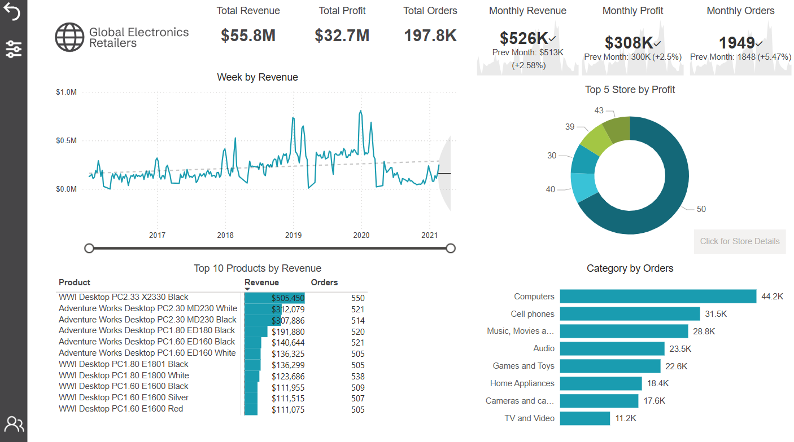
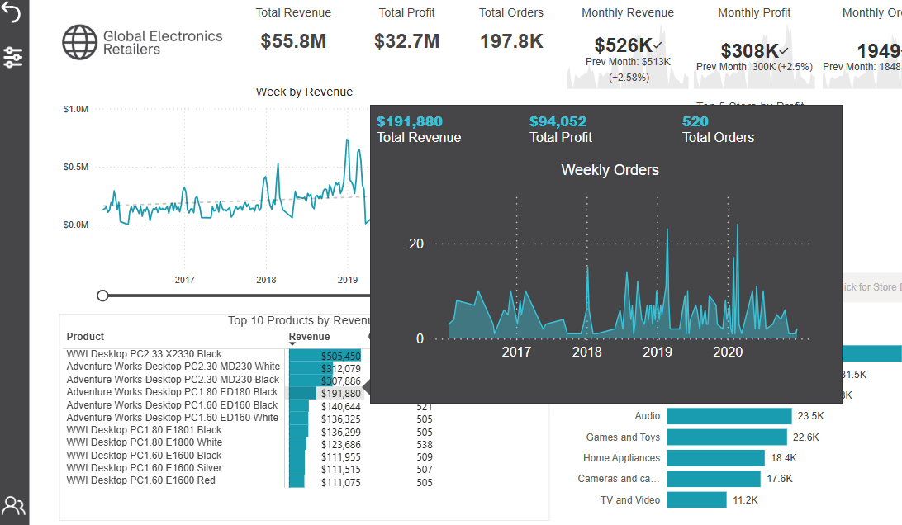
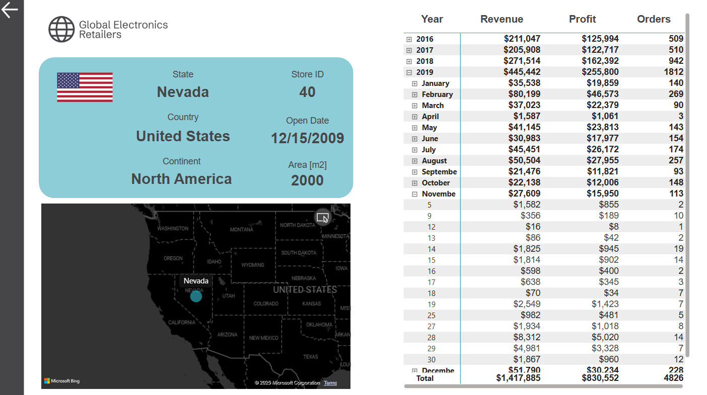
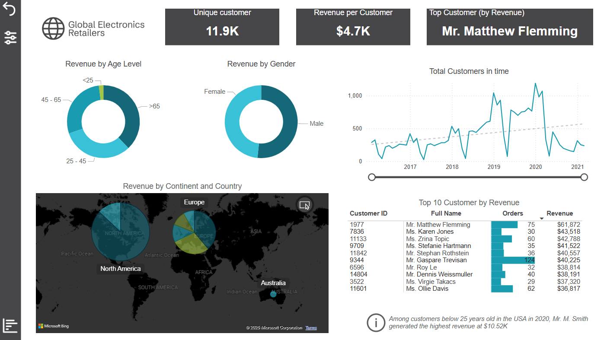
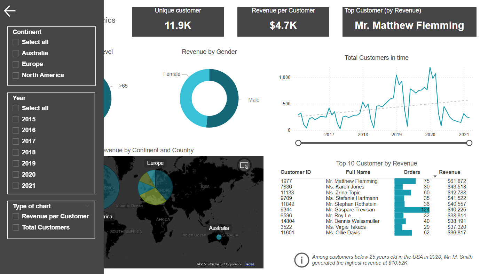

# 📊 Power BI Business Intelligence Portfolio


## 🎯 Project Overview

This comprehensive Power BI solution provides advanced business intelligence capabilities for **Global Electronics Retailers**, demonstrating key data analyst skills through interactive reports, advanced filtering, and user-centric design.

## 📋 Table of Contents

- [🎯 Project Overview](#-project-overview)
- [🛠️ Technologies Used](#️-technologies-used)
- [🎥 Demo Video](#-demo-video)
- [🚀 Key Features](#-key-features)
- [📊 Report Pages](#-report-pages)
- [💡 Technical Skills Showcased](#-technical-skills-showcased)
- [📈 Business Value](#-business-value)
- [🎓 Key Learnings](#-key-learnings)

## 🛠️ Technologies Used

- **Power BI Desktop** - Report development and data modeling
- **DAX (Data Analysis Expressions)** - Advanced calculations and measures
- **Power Query** - Data transformation and preparation
- **M Language** - Data cleaning and reshaping
- **Business Intelligence Design** - UX/UI best practices

## 🎥 Demo Video

https://github.com/jkiec/Data-Warehouse-Project/blob/main/PowerBI_Report/demo-video/report-demo.mp4

*A comprehensive walkthrough showcasing all interactive features, filtering capabilities, and advanced Power BI functionalities.*

## 🚀 Key Features

### ⚡ Advanced Interactivity
- **Cross-filtering** across all visualizations
- **Custom tooltips** with detailed trend analysis
- **Drill-through navigation** for detailed store analysis
- **Dynamic measures** with automatic title updates
- **Bookmark functionality** for saved analytical scenarios

### 🎛️ Smart Filtering System
- **Custom slicer panels** with clean, organized interface
- **Multi-level filtering** (geographic, temporal, demographic)
- **One-click filter reset** functionality
- **Geographic filtering** by continent and country

### 📱 User Experience Design
- **Intuitive navigation** with custom buttons
- **Responsive design** across all report pages
- **Professional branding** and consistent color schemes
- **Self-service analytics** capabilities

## 📊 Report Pages

### 1. 🏠 General Report Overview
**Comprehensive business performance monitoring**



- **KPI Dashboard**: Total Revenue ($55.8M), Profit ($32.7M), Orders (197.8K)
- **Trend Analysis**: Weekly revenue patterns with interactive zoom controls
- **Product Performance**: Top 10 products with detailed metrics
- **Store Analysis**: Performance breakdown by location
- **Category Insights**: Order distribution across product categories

**Key Features:**
- Interactive time controls with zoom slider functionality
- Custom tooltips showing weekly order trends for individual products

- Cross-filtering capabilities for deep-dive analysis

### 2. 🏪 Drill-Through Navigation
**Detailed store-specific analysis**



**Capabilities:**
- Store-specific performance pages with comprehensive data
- Location details, opening dates, area metrics, sales breakdowns
- Seamless back-button navigation for intuitive user experience
- Period-specific analysis (e.g., Black Friday 2019 performance)

### 3. 👥 Customer Analytics Report Page
**Advanced customer segmentation and behavior analysis**



**Analytics Features:**
- **Customer Segmentation**: Age group and gender-based analysis
- **Geographic Distribution**: World map visualization by continent/country
- **Dynamic Metrics**: Switchable measures (Revenue per Customer vs. Total Customers)
- **Top Customer Identification**: Ranking tables with detailed performance metrics
- **Trend Analysis**: Customer acquisition and behavior patterns over time

**Advanced Functionality:**
- Multi-level filtering combining demographic, geographic, and temporal data
- Bookmark functionality for quick access to predefined analytical views
- Dynamic chart titles that automatically update based on selected measures
- Responsive design with real-time visualization updates

### 4. 🔍 Advanced Filtering System
**Powerful data segmentation tools**



**Features:**
- Custom slicer panel accessible via navigation buttons
- Geographic filters: Continental and country-level segmentation
- Temporal filters: Year-based analysis with easy selection
- Clear filters functionality: One-click reset to complete dataset

## 💡 Technical Skills Showcased

### 📊 Data Modeling & Analysis
- Complex data relationships and hierarchies
- Advanced DAX calculations for dynamic measures
- Efficient data structure design for optimal performance

### 🎨 Visualization Design
- User experience (UX) focused report layout
- Intuitive navigation and interaction patterns
- Professional color schemes and consistent branding

### ⚙️ Advanced Power BI Features
- Custom navigation buttons and panels
- Drill-through page configuration
- Bookmark management for saved states
- Dynamic title and measure switching
- Cross-filtering and highlight interactions

### 📈 Business Intelligence Applications
- Strategic KPI monitoring and trend analysis
- Customer segmentation and behavioral insights
- Geographic market analysis and expansion planning
- Product performance evaluation and optimization
- Store operations efficiency assessment

## 📈 Business Value

### 🎯 Strategic Decision Making
- Comprehensive view of business performance across multiple dimensions
- Identification of top-performing customers, products, and locations
- Trend analysis for forecasting and planning purposes

### ⚡ Operational Efficiency
- Quick access to filtered views through bookmarks
- Drill-down capabilities for detailed investigation
- Self-service analytics reducing dependency on IT support

### 👤 User Experience
- Intuitive interface enabling non-technical users to explore data independently
- Consistent navigation patterns across all report pages
- Responsive design ensuring accessibility across devices


### 📁 Repository Structure
```
PowerBI-Report/
├── README.md
├── Sales-Report.pbix
├── demo-video/
│   └── report-demo.mp4
└── screenshots/
    ├── general-overview.png
    ├── custom-tooltip.png
    ├── customer-analytics.png
    ├── filtering-system.png
    └── store-analysis.png

```

## 🎓 Key Learnings

### 📚 Technical Skills Developed
- **Advanced DAX**: Created complex calculated measures and columns
- **Data Modeling**: Designed efficient star schema relationships
- **UX Design**: Implemented user-centric navigation and interaction patterns
- **Performance Optimization**: Optimized report performance for large datasets

### 💼 Business Intelligence Insights
- **Customer Behavior**: Identified key demographic patterns and preferences
- **Sales Trends**: Discovered seasonal patterns and product performance drivers
- **Geographic Analysis**: Revealed market opportunities and expansion potential
- **Operational Efficiency**: Highlighted top-performing stores and optimization opportunities

### 🔧 Problem-Solving Approach
- **User-Centric Design**: Prioritized ease of use and intuitive navigation
- **Scalable Architecture**: Built flexible solution for future data expansion
- **Interactive Storytelling**: Created engaging data narratives through visualizations