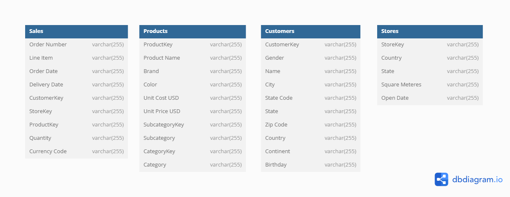
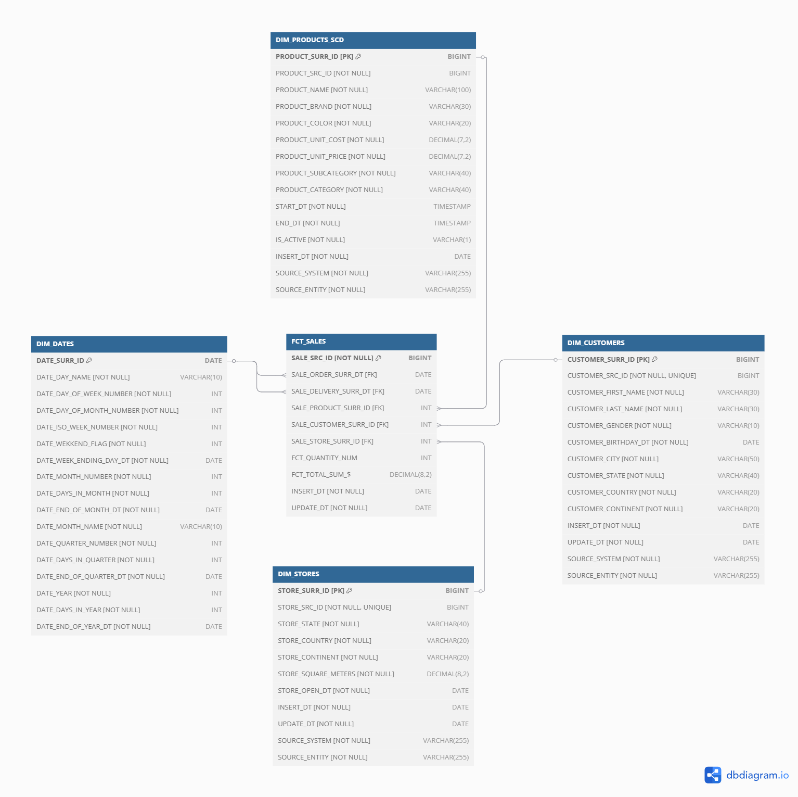
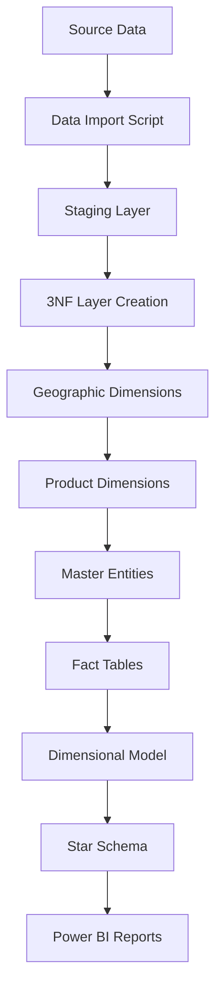

# 🏢 Global Electronics Retailers - Data Warehouse Project

A comprehensive end-to-end data warehouse solution for Global Electronics Retailers, implementing modern ETL practices with PostgreSQL and dimensional modeling for business intelligence and analytics.

## 📋 Table of Contents

- [Project Overview](#-project-overview)
- [Architecture](#-architecture)
- [Data Model](#-data-model)
- [Features](#-features)
- [Technology Stack](#-technology-stack)
- [Prerequisites](#-prerequisites)
- [Installation & Setup](#-installation--setup)
- [Usage](#-usage)
- [Data Pipeline](#-data-pipeline)
- [Testing](#-testing)
- [Power BI Reports](#-power-bi-reports)
- [Project Structure](#-project-structure)

## 🎯 Project Overview

This project demonstrates a production-ready data warehouse implementation for a global electronics retailer. The solution transforms raw transactional data into a dimensional model optimized for business analytics, following industry best practices for data warehousing.

### Business Context
Global Electronics Retailers operates across multiple countries with:
- 🛍️ **Sales transactions** from various stores
- 👥 **Customer data** with geographic distribution
- 📦 **Product catalog** with hierarchical categorization
- 🏪 **Store locations** with operational details

### Key Objectives
- **Data Integration**: Consolidate data from multiple source systems
- **Data Quality**: Implement robust data validation and cleansing
- **Performance**: Optimize for analytical query performance
- **Scalability**: Design for growing data volumes
- **Governance**: Maintain data lineage and audit trails

## 🏗️ Architecture

The data warehouse follows a traditional three-layer architecture:

```
┌─────────────────┐    ┌─────────────────┐    ┌─────────────────┐    ┌─────────────────┐
│   SOURCE DATA   │ => │  STAGING LAYER  │ => │   3NF LAYER     │ => │  DIMENSIONAL    │
│                 │    │                 │    │  (NORMALIZED)   │    │     MODEL       │
│ • Sales CSV     │    │ • Data Cleaning │    │ • Business      │    │ • Star Schema   │
│ • Customers CSV │    │ • Validation    │    │   Rules         │    │ • Aggregations  │
│ • Products CSV  │    │ • Standardization│   │ • Referential   │    │ • Performance   │
│ • Stores CSV    │    │ • Deduplication │    │   Integrity     │    │   Optimization  │
└─────────────────┘    └─────────────────┘    └─────────────────┘    └─────────────────┘
```

### Layer Details

#### 🔄 **Staging Layer** (`staging` schema)
- Raw data ingestion and initial cleaning
- Data type standardization and validation
- Duplicate detection and removal
- Minimal transformations to preserve source data integrity

#### 🏢 **3NF Layer** (`bl_3nf` schema)
- Normalized database design (Third Normal Form)
- Implementation of business rules and constraints
- Referential integrity maintenance
- Support for Slowly Changing Dimensions (SCD Type 1 & 2)

#### ⭐ **Dimensional Model** (`bl_dm` schema)
- Star schema design optimized for analytics
- Denormalized dimensions for query performance
- Fact tables with automatic partitioning
- Pre-aggregated measures for reporting

## 📊 Data Model

### Data Architecture Diagrams

#### Staging Layer Schema

*Raw data tables with basic cleaning and validation*


*Data flow from data_source layer to staging*

#### 3NF Layer Schema

*Normalized business model with referential integrity*


*Data flow from staging layer to 3NF layer*

#### Dimensional Model Schema

*Star schema optimized for analytical queries*


*Data flow from 3NF layer to Dimensional layer*

### Key Entities

#### 📦 **Products**
- **SCD Type 2**: Maintains price history over time
- **Hierarchy**: Category → Subcategory → Product
- **Attributes**: Brand, Color, Unit Cost, Unit Price

#### 👥 **Customers** 
- **SCD Type 1**: Current state only (name/location updates)
- **Geography**: Full hierarchy (Continent → Country → State → City)
- **Attributes**: Name, Gender, Birthday, Location

#### 🏪 **Stores**
- **Static Dimension**: Store attributes rarely change
- **Geography**: Location hierarchy (Continent → Country → State)
- **Attributes**: Size (sq meters), Opening Date

#### 🛍️ **Sales (Fact Table)**
- **Partitioned**: Monthly partitions for performance
- **Measures**: Quantity, Total Amount, Net Amount
- **Grain**: One row per order line item

#### 📅 **Date Dimension**
- **Time Intelligence**: Complete calendar attributes
- **Business Calendar**: Weekends, Quarters, Fiscal periods
- **Auto-generated**: Based on actual sales date ranges

## ✨ Features

### 🔧 **ETL Capabilities**
- **Incremental Loading**: Date-based watermarks for efficient processing
- **Error Handling**: Comprehensive logging and rollback mechanisms
- **Data Quality**: Built-in validation rules and data profiling
- **Monitoring**: Real-time ETL execution tracking

### 📈 **Performance Optimizations**
- **Table Partitioning**: Automatic monthly partitioning on fact tables
- **Denormalization**: Star schema design reduces JOIN complexity
- **Surrogate Keys**: Integer keys for improved JOIN performance

### 🔍 **Data Governance**
- **Audit Trail**: Complete data lineage tracking
- **Source Attribution**: Every record tracks its source system
- **Data Quality Metrics**: Automated data profiling and monitoring
- **Change Detection**: SCD implementations for historical tracking

### 🧪 **Testing Framework**
- **Smoke Tests**: Basic connectivity and structure validation
- **Critical Tests**: Core ETL functionality validation
- **Extended Tests**: Performance benchmarks and business rule validation
- **Automated Testing**: Continuous integration support

## 🛠️ Technology Stack

| Component | Technology | Purpose |
|-----------|------------|---------|
| **Database** | PostgreSQL 14+ | Data warehouse platform |
| **ETL Language** | PL/pgSQL | Stored procedures and functions |
| **Data Ingestion** | Python + Pandas | CSV processing and data loading |
| **Testing** | Python + pytest | Automated testing framework |
| **Reporting** | Power BI | Business intelligence and visualization |
| **Version Control** | Git | Source code management |
| **Documentation** | Markdown | Project documentation |

## 📋 Prerequisites

Before setting up the project, ensure you have:

### System Requirements
- **PostgreSQL 14+** installed and running
- **Python 3.8+** with pip package manager
- **Power BI Desktop** (for reports)
- **Git** for version control

### Python Dependencies
```bash
pandas>=1.3.0
sqlalchemy>=1.4.0
psycopg2-binary>=2.9.0
pytest>=6.0.0
kaggle>=1.5.0
```

### Database Setup
- PostgreSQL server with sufficient storage (minimum 2GB recommended)
- Database user with CREATE/DROP privileges
- Network connectivity to database server

## 🚀 Installation & Setup

### 1. Database Configuration
```sql
-- Create database
CREATE DATABASE global_electronics_retailers;

-- Create schemas
CREATE SCHEMA data_source;
CREATE SCHEMA staging;
CREATE SCHEMA bl_3nf;
CREATE SCHEMA bl_dm;
CREATE SCHEMA bl_cl;
```

### 2. Configure Connections
Update database connection settings in:
- `import_data.py` (line 47-53)
- `tests/test_suite.py` (line 15-22)

```python
db_config = {
    'host': 'localhost',
    'port': '5432',
    'database': 'global_electronics_retailers',
    'user': 'your_username',
    'password': 'your_password'
}
```

### 3. Kaggle API Setup (Optional)
If using Kaggle dataset:
```bash
# Install Kaggle CLI
pip install kaggle

# Configure API credentials
# Place kaggle.json in ~/.kaggle/
```

## 💡 Usage

### Data Loading Process

#### Step 1: Import Source Data
```bash
# Download and load source data
python import_data.py
```

#### Step 2: Create Database Object
```sql
-- Execute DDL script:
\i sql/log_table_and_procedure.sql
```

#### Step 4: Execute Full ETL Pipeline
```sql
-- Run complete ETL process
CALL bl_cl.sp_run_full_etl();
```

## 🔄 Data Pipeline

### ETL Execution Flow



### Staging Layer Procedures
- `sp_load_sales_data()` - Sales transactions with data cleaning
- `sp_load_customers_data()` - Customer master with deduplication
- `sp_load_products_data()` - Product catalog with validation
- `sp_load_stores_data()` - Store locations with standardization

### 3NF Layer Procedures
- `sp_load_ce_continents()` - Geographic hierarchy (level 1)
- `sp_load_ce_countries()` - Geographic hierarchy (level 2)
- `sp_load_ce_states()` - Geographic hierarchy (level 3)
- `sp_load_ce_cities()` - Geographic hierarchy (level 4)
- `sp_load_ce_categories()` - Product hierarchy (level 1)
- `sp_load_ce_subcategories()` - Product hierarchy (level 2)
- `sp_load_ce_products_scd()` - Products with SCD Type 2
- `sp_load_ce_customers()` - Customers with SCD Type 1
- `sp_load_ce_stores()` - Store master data
- `sp_load_ce_sales()` - Sales fact table

### Dimensional Model Procedures
- `sp_create_dim_ddl_objects()` - Create star schema objects
- `populate_dim_dates_auto()` - Auto-populate date dimension
- `sp_load_dim_customers()` - Denormalized customer dimension
- `sp_load_dim_products_scd()` - Denormalized product dimension with SCD
- `sp_load_dim_stores()` - Denormalized store dimension
- `sp_load_fct_sales()` - Partitioned sales fact table

## 🧪 Testing

### Test Framework Overview

The project includes a comprehensive testing framework with three levels:

#### 🔥 **Smoke Tests** - Basic Validation
```bash
python -m pytest tests/test_smoke.py -v
```
- Database connectivity
- Schema existence
- Source data availability
- ETL logging infrastructure

#### 🎯 **Critical Tests** - Core Functionality
```bash
python -m pytest tests/test_critical.py -v
```
- Staging layer ETL processes
- 3NF layer transformations
- Dimensional model creation
- Data quality validations
- SCD functionality

#### 🚀 **Extended Tests** - Comprehensive Validation
```bash
python -m pytest tests/test_extended.py -v
```
- Full end-to-end ETL pipeline
- Business rules validation
- Performance benchmarks
- Data lineage verification

### Running All Tests
```bash
# Execute complete test suite
python tests/test_runner.py

# View test results
cat dw_tests.log
```

### Test Results Interpretation
- **Green (✅)**: Test passed successfully
- **Yellow (⚠️)**: Warning - check details
- **Red (❌)**: Test failed - requires attention

## 📊 Power BI Reports

### Report Overview
The Power BI solution provides comprehensive business intelligence capabilities:

#### 📈 **Sales Performance Report**

#### 👥 **Customer Analytics**

#### 📦 **Product Analysis**

#### 🏪 **Store Operations**

### Report File
- `PowerBI-Report/Sales-Report.pbix`
- 
### Detailed description of the report 
- `PowerBI-Report/README.md` 

### Data Refresh
Power BI connects directly to the dimensional model:
```
Data Source: PostgreSQL
Server: localhost:5432
Database: global_electronics_retailers
Tables: bl_dm.* (all dimensional model tables)
```

## 📁 Project Structure

```
Data-Warehouse-Project/
├── 📂 sql/                          # SQL scripts
│   ├── 📂 staging/                  # Staging layer procedures
│   ├── 📂 3nf/                      # 3NF layer procedures
│   ├── 📂 dimensional/              # Dimensional model procedures
│   └── 📂 utils/                    # Utility scripts
├── 📂 python/                       # Python scripts
│   ├── import_data.py               # Data import script
│   ├── dw_etl_tests.py              # DWH tests
│   └── dw_tests.log                 # DWH tests result log
├── 📂 PowerBI-Report/               
│   ├── README.md                    # Report description
│   ├── Sales-Report.pbix            # Power BI report
│   ├── 📂  demo-video/
│   │   └── report-demo.mkv          # Demo Video
│   └── 📂screenshots/
│       ├── general-overview.png
│       ├── customer-analytics.png
│       ├── filtering-system.png
│       └── store-analysis.png
├── 📂 docs/                                                 # Documentation
│   ├── data_mapping_from_data_source_to_staging.pdf         # Data flow from source to staging layer
│   ├── data_mapping_from_staging_to_3NF_layer.pdf           # Data flow from staging to 3NF layer
│   ├── data_mapping_from_3NF_to_dimensional_layer.pdf       # Data flow from 3NF to dimensional layer
│   ├── logical_schema_staging_layer.png                     # Staging layer schema
│   ├── logical_schema_3NF_layer.png                         # 3NF layer schema
│   └── logical_schema_dimensional_layer.png                 # Dimensional model schema
└── README.md                        # Project description

```

*This project demonstrates production-ready data warehouse implementation using modern ETL practices and dimensional modeling principles.*